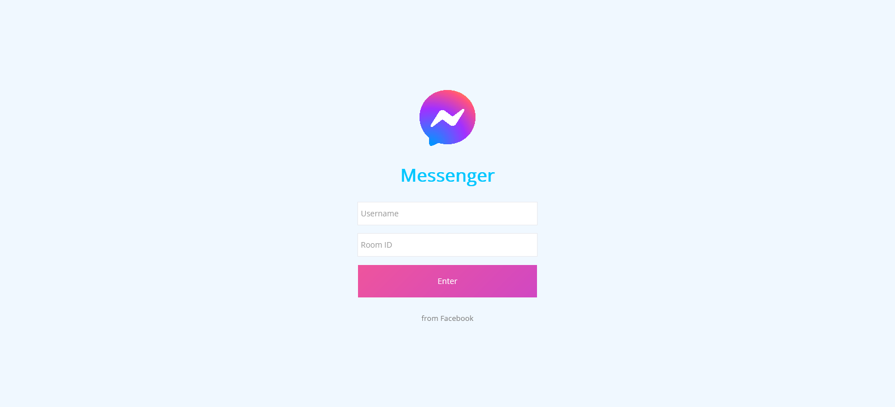

# simple-chat-app

> _This repo was created for learning purposes and one of the [_**#Coming Back To Programming**_](https://github.com/xvferdy/beginner-portfolio "Beginner Portfolio") activities that started on September 24 2021…_

## :round_pushpin:Table of Contents
- [About The Project](#about-the-project)
    - [Live](#live-httpssimple-chat-app-xvferdynetlifyapp)
    - [Built with](#built-with)   
- [Getting Started](#getting-started)
    - [Prerequisites](#prerequisites)
    - [Installation](#installation)


## About the Project
Very simple chat app where people with unique ID send messages to each other in the same room.

**Overview** 🌈
<p align="">
  
</p>

### Live https://simple-chat-app-xvferdy.netlify.app/

### Built With
- React
- Node.js
- Express
- [Socket.IO](https://socket.io/) ver ^4.3.2


## Getting Started
### Prerequisites
- [Node.js](https://nodejs.org/en/)
- [NPM](https://www.npmjs.com/)


### Installation
```
npm install
```
```
npm start
```

# //
